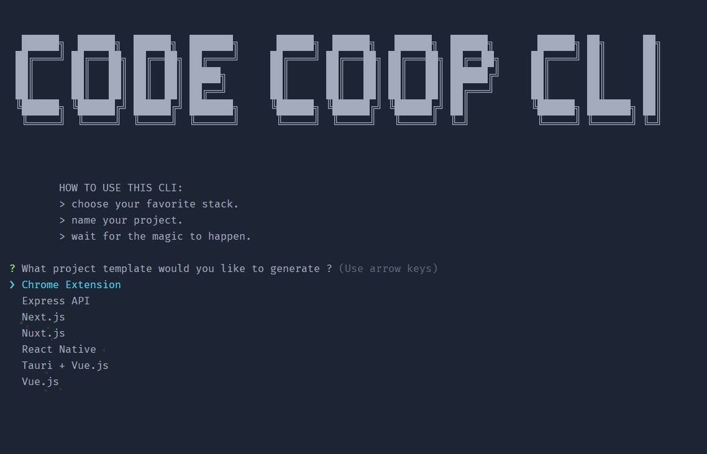

# CODE COOP CLI

A simple CLI to create project from template



## Features

-   Create your template from a list of options.
-   Using latest version of all templates.
-   Add utility first CSS (TailwindCSS).

## Install localy

```bash
cd code-coop

npm install -g
```

## Usage

```bash
code-coop
```

```text
HOW TO USE THIS CLI:
    > choose your favorite stack.
    > name your project.
    > wait for the magic to happen.

? What project template would you like to generate ? (Use arrow keys)
❯  Chrome Extension
❯  Express API
❯  Next.js
❯  Nuxt.js
❯  React Native
❯  Tauri + Vue.js
❯  Vue.js
```

## Templates folder format

Whether you are a front-end, back-end, mobile or desktop developer, you will find the best option for your starter template. The first level in the folder is the stack, and the second level is the actual template.

```bash
├── Desktop
│   └── Tauri + Vue.js
├── Mobile
│   └── React Native
├── Extension
│   └── Chrome Extension
├── Back-end
│   └── Express API
└── Front-end
    ├── Next.js
    ├── Nuxt.js
    └── Vue.js
```
